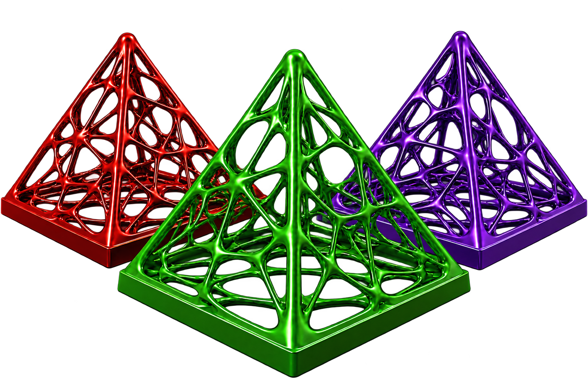

<p align="center">
  
</p>

# TopOpt.jl

[](https://github.com/juliatopopt/TopOpt.jl/actions)
[](https://juliatopopt.github.io/TopOpt.jl/stable)
[](https://juliatopopt.github.io/TopOpt.jl/dev)
[](https://codecov.io/gh/juliatopopt/TopOpt.jl)
[](https://github.com/JuliaTesting/Aqua.jl)
[](https://github.com/invenia/BlueStyle)
[](https://github.com/aviatesk/JET.jl)

`TopOpt` is a topology optimization package written in [Julia](https://github.com/JuliaLang/julia). It supports structural (linear elasticity) and heat-transfer problems on continuum and truss ground meshes in 2D and 3D, with automatic differentiation through every objective and constraint.


## Installation

See the [installation section of the documentation](https://juliatopopt.github.io/TopOpt.jl/stable/#installation)
([dev](https://juliatopopt.github.io/TopOpt.jl/dev/#installation)).

## Features

The full list of features is maintained in one place, the
[documentation](https://juliatopopt.github.io/TopOpt.jl/stable/#features)
([dev](https://juliatopopt.github.io/TopOpt.jl/dev/#features)).

## Tutorials

Executable, commented tutorials are hosted on the documentation site:
[TopOpt.jl Tutorials](https://juliatopopt.github.io/TopOpt.jl/stable/tutorials/)
([dev](https://juliatopopt.github.io/TopOpt.jl/dev/tutorials/)).

## Citation

If you use TopOpt.jl in your research, please cite the following journal paper
and conference publications.

- [Adaptive continuation solid isotropic material with penalization for volume constrained compliance minimization](https://doi.org/10/gg55cc)

```bibtex
@article{TarekRay2020,
  title={Adaptive continuation solid isotropic material with penalization for volume constrained compliance minimization},
  author={Tarek, Mohamed and Ray, Tapabrata},
  journal={Computer Methods in Applied Mechanics and Engineering},
  volume={363},
  pages={112880},
  year={2020},
  doi={10/gg55cc}
}
```

- TopOpt.jl: An efficient and high-performance package for topology optimization of continuum structures in the Julia programming language

```bibtex
@inproceedings{tarek2019topoptjl,
  title={TopOpt.jl: An efficient and high-performance package for topology optimization of continuum structures in the Julia programming language},
  author={Tarek, Mohamed},
  booktitle={Proceedings of the 13th World Congress of Structural and Multidisciplinary Optimization},
  year={2019}
}
```

- [TopOpt.jl: Truss and Continuum Topology Optimization, Interactive Visualization, Automatic Differentiation and More](https://web.mit.edu/yijiangh/www/papers/topopt_jl_WCSMO2021.pdf)

```bibtex
@inproceedings{huang2021topoptjl,
  title={TopOpt.jl: Truss and Continuum Topology Optimization, Interactive Visualization, Automatic Differentiation and More},
  author={Huang, Yijiang and Tarek, Mohamed},
  booktitle={Proceedings of the 14th World Congress of Structural and Multidisciplinary Optimization},
  year={2021}
}
```

A standard citation file is provided as [`CITATION.bib`](CITATION.bib).

## Contribute

We welcome new contributors! Please see the
[open issues](https://github.com/JuliaTopOpt/TopOpt.jl/issues) for beginner-friendly
and research-oriented tasks, or open a new issue to discuss your idea.

## Questions?

If you have any questions, join us on the #topopt channel in the [Julia slack](https://julialang.org/slack/), open an issue or shoot us an email.
