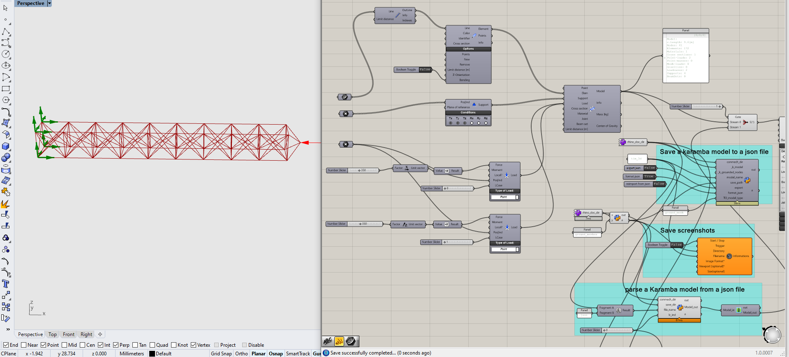

# Truss problem makers
This is a [Grasshopper](https://www.grasshopper3d.com/) script on the [Rhinoceros](https://www.rhino3d.com/) platform, 
used for creating case studies (ground structures/fea verifications).

The Grasshopper script depends on [Karamba3d](https://www.karamba3d.com/) for assembling the model (elements, fixities, loads, materials, cross sections, etc.). 
The free version of Karamba3d would suffice since we don't use its analysis components.

We uses the io modules from [conmech](https://github.com/yijiangh/conmech) to do two-way conversions between the Karamba models and `json` files.
Notice that the json file uses zero-based indexing. We do index conversion in the `TrussIO` module.

Optionally, the script uses [FabTools](http://blickfeld7.com/architecture/rhino/grasshopper/FabTools/) to automate saving screenshots.

