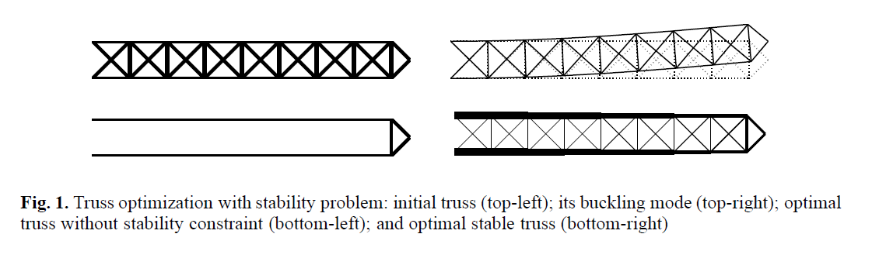
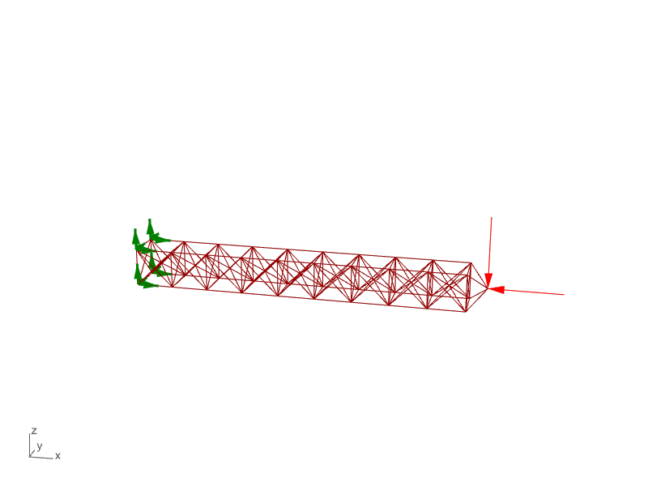

# References

TODO: write about JSON file specs.

## `tim2d` and `tim3d`

Taken from: 

    Fiala, J., Kočvara, M., Stingl, M., 2013. PENLAB: A MATLAB solver for nonlinear semidefinite optimization. arXiv:1311.5240 [math].
